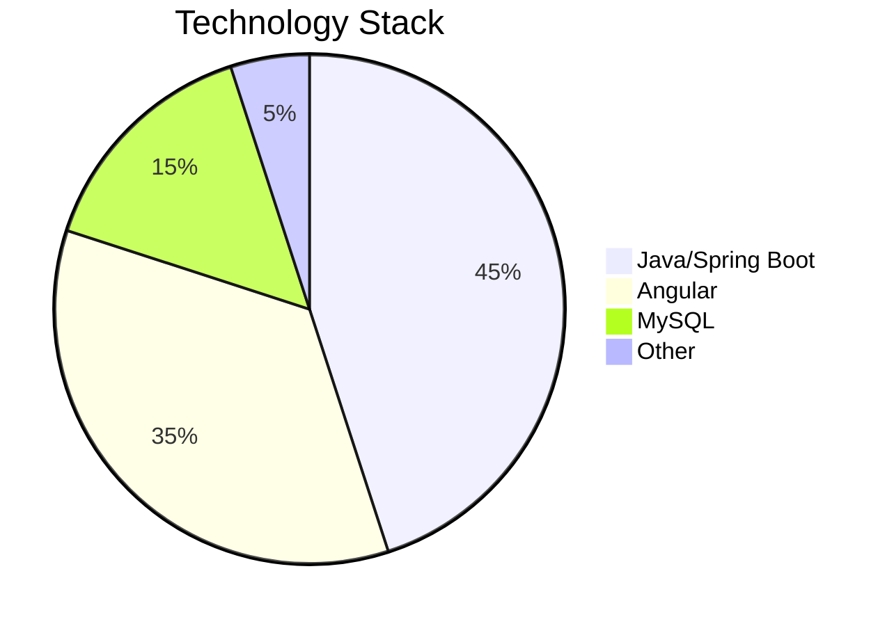

# 🚀 TrainVerse - Next-Gen E-Learning Platform

<div align="center">
  
  
  
  
</div>

<div align="center">
  
</div>

## ✨ Key Features

| Feature | Description |
|---------|-------------|
| 👨‍🎓 **Role-Based Access** | Three distinct dashboards for Students, Professors, and Admins |
| 📚 **Course Management** | Create, enroll, and track courses with intuitive UI |
| 🔐 **Secure Auth** | JWT authentication with role-based permissions |
| 📱 **Responsive Design** | Works flawlessly on all devices |
| 🚀 **Modern Stack** | Built with Spring Boot & Angular |

## 🛠️ Tech Stack



## 🚀 Getting Started

### Prerequisites

✔️ Java 17+  
✔️ Node.js 16+  
✔️ MySQL 8.0+  
✔️ Angular CLI 15+

### Installation

```bash
# 1. Clone the repository
git clone https://github.com/yourusername/TrainVerse.git
cd TrainVerse

# 2. Start backend
cd backend
mvn spring-boot:run

# 3. Start frontend (in new terminal)
cd ../frontend
npm install && ng serve
```

🌐 Access the app at: [http://localhost:4200](http://localhost:4200)

## 📂 Project Structure

```bash
TrainVerse/
├── backend/          # Spring Boot Application
│   ├── src/
│   │   ├── main/java/com/trainverse/
│   │   │   ├── config/       # Security config
│   │   │   ├── controllers/  # REST APIs
│   │   │   └── models/       # JPA Entities
│   └── pom.xml
│
├── frontend/         # Angular Application
│   ├── src/
│   │   ├── app/
│   │   │   ├── admin/        # Admin modules
│   │   │   ├── professor/    # Professor modules
│   │   │   └── student/      # Student modules
│   └── package.json
└── README.md
```

## 🤝 Want to Contribute?

We love contributors! Here's how you can help:

1. 🐛 Found a bug? [Open an issue](https://github.com/yourusername/TrainVerse/issues)
2. 💡 Have a feature idea? Start a discussion
3. 👩‍💻 Fork the repo and submit a PR

## 📜 License

MIT © [TrainVerse Team]

---

<div align="center">
  Made with ❤️ by Us | 📧 sdinesh7038@gmail.com
</div>
